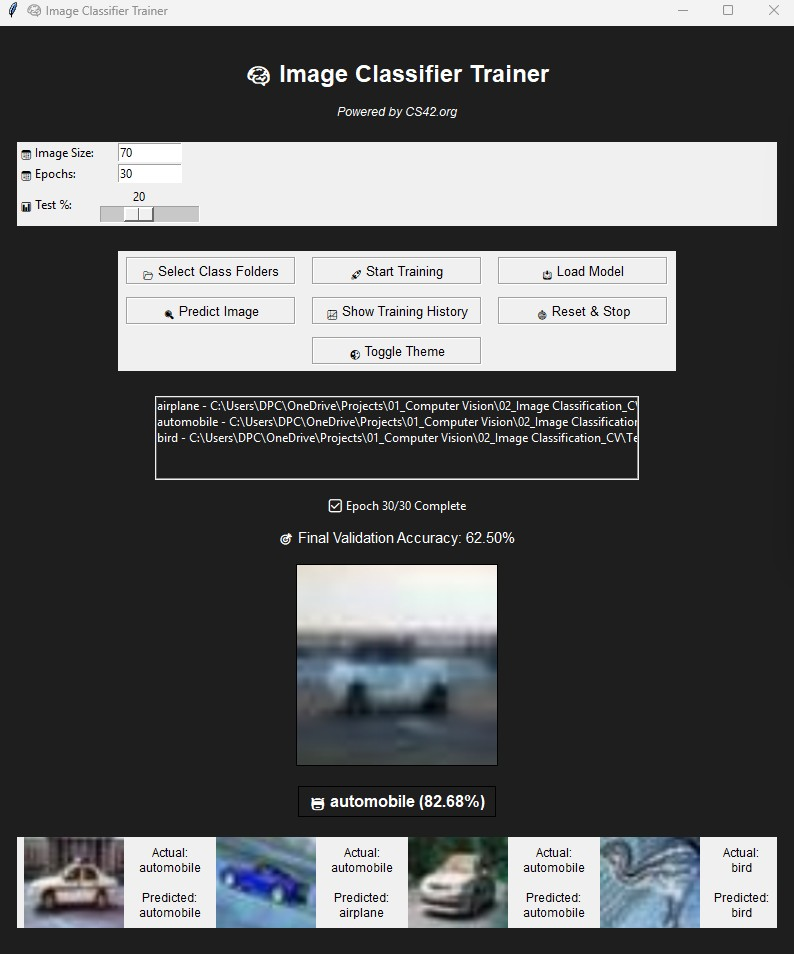
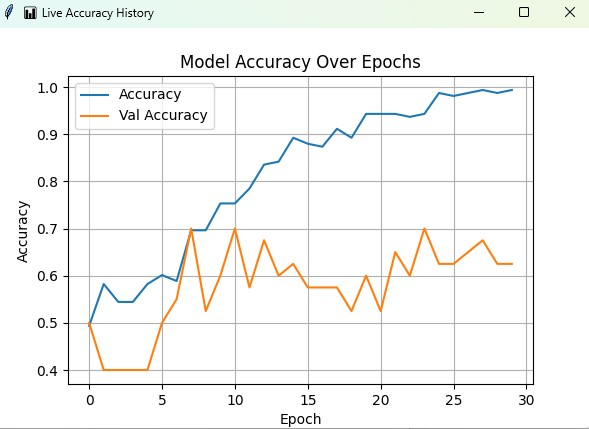

# 🧠 Image Classifier Trainer UI

A desktop GUI tool to train and test image classifiers using TensorFlow and Tkinter. 
Created by **CS42.org**.

---

## 📦 Features

- Select folders of categorized images for training.
- Customize image size, number of epochs, and test split.
- Track training progress with animated accuracy plot.
- See final validation accuracy after training.
- Display 5 random prediction results from validation set.
- Save/load model in `.keras` format.
- Toggle between dark and light themes.
- Reset the program anytime.

---

## 🖼 Folder Structure Example

```
├── airplane/
│   ├── 1.jpg
│   ├── 2.jpg
├── automobile/
│   ├── 1.jpg
│   ├── 2.jpg
```

---

## 🚀 Getting Started

### 1. Install dependencies

```bash
pip install -r requirements.txt
```

### 2. Run the app

```bash
python Image_Classifier_Code.py
```

---

## 🔧 Model Info

- 3 Conv2D + MaxPooling layers
- Dense layers with ReLU and Softmax
- Optimizer: Adam
- Loss: Sparse Categorical Crossentropy

---

## 📈 Screenshots

### ✅ GUI in action



### 📊 Live Accuracy Plot



---

## 💾 Outputs

- Trained model: `model_ui.keras`
- Class list: `model_ui_classes.txt`

---

## 📜 License: MIT

### ✔️ You can:
- Use commercially or personally
- Modify and redistribute

### ❗ You must:
- Include this license
- Attribute the original author

> No warranty is provided with this software.

---

## 🧑‍💻 Built by [CS42.org](https://cs42.org)

